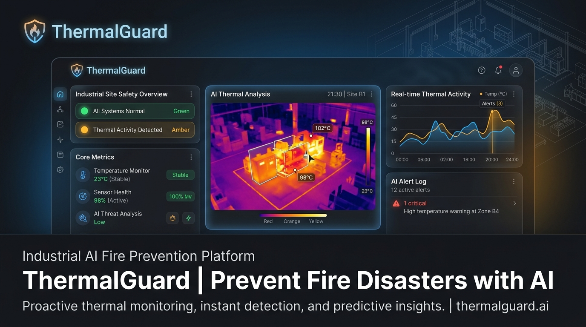
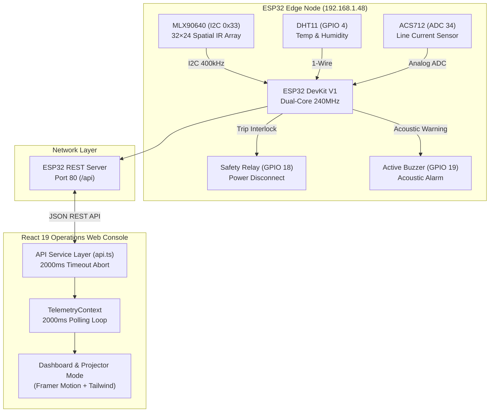
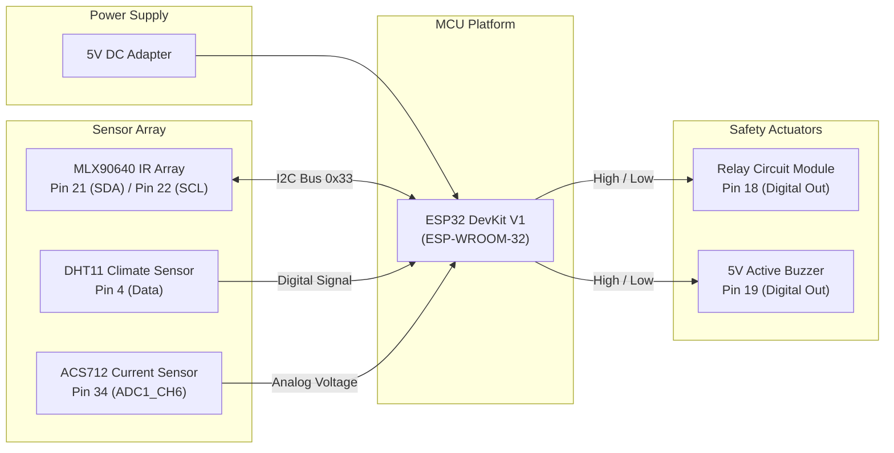

# ThermalGuard — Industrial Thermal Intelligence & Fire Prevention



**ThermalGuard** is an end-to-end industrial thermal intelligence and fire safety system. By coupling ESP32 edge processing with high-resolution infrared thermal imaging (MLX90640), ambient environmental sensing (DHT11), and high-frequency current telemetry (ACS712), ThermalGuard isolates electrical micro-hotspots before insulation breakdown causes ignition.

---

## 🏛 System Architecture Diagram



---

## 🔌 Hardware Block Diagram



---

## 📁 Repository Folder Structure

```
ThermalGuard/
├── Hardware/                         # ESP32 C++ PlatformIO / Arduino Sketch
│   └── ThermoGuard_V1.ino           # Core edge firmware (Sensors, REST Server, Interlocks)
│
├── web/                              # Operations Console Web Application
│   ├── public/                       # Favicons & Open Graph Social Media Assets
│   │   ├── favicon.svg              # Vector brand favicon
│   │   └── og-image.png             # Social preview image banner
│   │
│   ├── src/
│   │   ├── app/
│   │   │   ├── components/
│   │   │   │   ├── hardware/        # 1-to-1 Hardware-mapped components
│   │   │   │   │   ├── RelayControlPanel.tsx  # GPIO 18 Relay Control
│   │   │   │   │   ├── BuzzerAlarmPanel.tsx  # GPIO 19 Acoustic Buzzer
│   │   │   │   │   ├── EnvironmentalCard.tsx # GPIO 4 DHT11 Sensor Card
│   │   │   │   │   └── CurrentLoadChart.tsx  # ADC 34 ACS712 Current Chart
│   │   │   │   │
│   │   │   │   └── thermalguard/    # UI Design System & Visualizers
│   │   │   │       ├── ThermalHeatmap.tsx     # MLX90640 Spatial Heat Canvas
│   │   │   │       ├── PresentationView.tsx   # Fullscreen Projector Demo Mode
│   │   │   │       ├── SensorCard.tsx         # Fault-tolerant Metric Card
│   │   │   │       ├── TopHeader.tsx          # Operator Header & Mode Switcher
│   │   │   │       └── SidebarNav.tsx         # Responsive Sidebar Navigation
│   │   │   │
│   │   │   ├── context/
│   │   │   │   └── TelemetryContext.tsx       # Polling loop & state provider
│   │   │   │
│   │   │   ├── services/
│   │   │   │   ├── api.ts                     # Central REST client & safe defaults
│   │   │   │   └── telemetryTypes.ts          # TypeScript interfaces
│   │   │   │
│   │   │   ├── App.tsx                        # Application Root
│   │   │   └── routes.tsx                     # React Router 7 Navigation Views
│   │   │
│   │   ├── styles/                            # Design tokens & CSS styles
│   │   └── main.tsx                           # Entry point
│   │
│   ├── index.html                             # SEO Metadata & Open Graph Head
│   ├── package.json                           # Dependencies & Scripts
│   └── vite.config.ts                         # Vite Build Tooling Config
│
├── README.md                                  # Production System Documentation
└── .gitignore
```

---

## 📡 REST API Documentation

The ESP32 firmware exposes a REST API server running on port `80` at `http://192.168.1.48/api`.

### 1. `GET /api/sensors`
Fetches real-time sensor metrics from MLX90640, DHT11, and ACS712.

**Response Schema (`200 OK`):**
```json
{
  "hotspotTemp": 42.8,
  "ambientTemp": 27.4,
  "humidity": 46,
  "lineCurrent": 8.2,
  "timestamp": "09:42:18"
}
```

---

### 2. `GET /api/thermal`
Fetches the 768-pixel spatial array output from the MLX90640 camera.

**Response Schema (`200 OK`):**
```json
{
  "minTemp": 22.1,
  "maxTemp": 42.8,
  "avgTemp": 29.6,
  "hotspotX": 22,
  "hotspotY": 14,
  "fps": 8.0,
  "pixels": [ 22.1, 22.4, 25.8, ... 768 float values ]
}
```

---

### 3. `GET /api/health`
Returns ESP32 edge node diagnostic health parameters.

**Response Schema (`200 OK`):**
```json
{
  "cpuLoad": 32,
  "memoryUsage": 48,
  "wifiSignal": 88,
  "storageUsage": 22
}
```

---

### 4. `POST /api/settings`
Updates safety trip thresholds and writes values to ESP32 Flash EEPROM.

**Request Body (`application/json`):**
```json
{
  "tempThreshold": 45.0,
  "currentLimit": 10.0,
  "alarmDelay": 5.0,
  "relayTripDelay": 2.0
}
```

---

## 🛠 Installation Guide

### Prerequisites
- **Node.js** (v18.0.0 or higher)
- **npm** or **pnpm**
- **Arduino IDE** or **PlatformIO IDE** (for flashing ESP32 hardware)

---

### 1. Firmware Flashing (ESP32 Edge Node)
1. Open `Hardware/ThermoGuard_V1.ino` in Arduino IDE or PlatformIO.
2. Install required Arduino libraries:
   - `Adafruit MLX90640`
   - `DHT sensor library`
   - `ArduinoJson`
3. Configure your local Wi-Fi SSID and Password in `ThermoGuard_V1.ino`:
   ```cpp
   const char* ssid = "YOUR_WIFI_SSID";
   const char* password = "YOUR_WIFI_PASSWORD";
   ```
4. Connect ESP32 DevKit V1 via USB and click **Upload**.

---

### 2. Web Operations Dashboard Setup
```bash
# Clone the repository
git clone https://github.com/Sumeet-basfore/ThermalGuard.git
cd ThermalGuard/web

# Install npm dependencies
npm install

# Start local development server
npm run dev
```
Open your browser at `http://localhost:5173`.

---

## 🎮 Demo Setup Instructions

ThermalGuard includes a **Demo Mode** simulation engine, allowing full evaluation without physical ESP32 hardware connected.

### Option A: Demo Mode (No Hardware Required)
1. Launch the web dashboard (`npm run dev`).
2. In the top bar header, click the **DEMO** mode button.
3. The dashboard will stream simulated high-frequency telemetry with realistic variance.
4. Press **`F`** to launch **Projector Presentation Mode**.

### Option B: Live Mode (Physical ESP32 Connected)
1. Flash the ESP32 node and note its IP address (e.g. `192.168.1.48`).
2. In the top bar header, toggle the mode switcher to **LIVE**.
3. Telemetry polling will connect directly to `http://192.168.1.48/api`.

---

## ⚠️ Known Limitations

1. **MLX90640 Sample Rate**: Capped at 8.0 FPS due to I2C clock frequency limits (400 kHz) on ESP32.
2. **DHT11 Response Latency**: Requires a minimum sampling interval of 2.0s between sequential temperature reads.
3. **HTTP Server Concurrency**: ESP32 single-socket HTTP server handles polling requests sequentially; client polling is throttled to 2000ms intervals to prevent connection starvation.

---

## 🔮 Future Scope

- [ ] **MQTT / CoAP Protocol Integration**: Migration to MQTT for publish-subscribe streaming to AWS IoT Core and Azure IoT Hub.
- [ ] **WebSockets / SSE Push**: Replace HTTP polling loops with real-time Server-Sent Events (SSE) for sub-100ms array frame updates.
- [ ] **Multi-Node Substation Grid**: Centralized grid topology view managing multiple ESP32 nodes across industrial facilities.
- [ ] **Edge ML Thermal Forecasting**: TinyML models running on-device (TensorFlow Lite for Microcontrollers) to predict insulation breakdown 30 minutes before thermal trip thresholds are reached.

---

## 📄 License

Distributed under the MIT License. See `LICENSE` for details.
